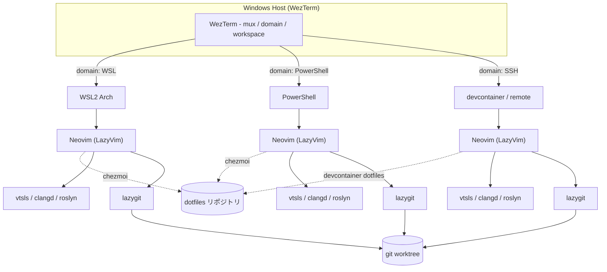
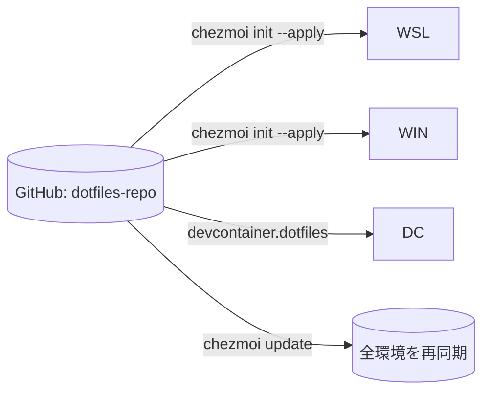
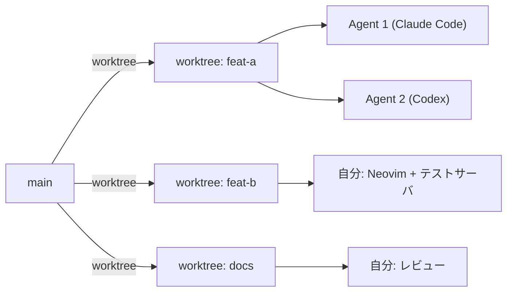

# Terminal-Driven Development Environment

Claude Code / Codex の TUI で開発する前提で、ターミナルから一切出ずに完結する開発環境を作るためのリポジトリです。
**WezTerm + Neovim (LazyVim) + lazygit + chezmoi** を核に、**WSL Arch / devcontainer / PowerShell** の 3 環境で同等の操作感を実現します。

> 元になった設計思想は [design.md](design.md) を参照。

## この環境が解決する問題

- VSCode の重さに耐えられず、編集もターミナル内で完結させたい
- Markdown / Mermaid を **ターミナル内** でプレビューしたい
- TypeScript / C# / C++ など多言語の LSP を統一キーバインドで使いたい
- **git worktree** を使って Agent と並行開発したい
- Agent を回しながら自分もコード閲覧・テスト起動・レビューしたい
- WSL / コンテナ / PowerShell を 1 つのターミナルにまとめたい

## クイックスタート

| 環境 | コマンド |
|---|---|
| Linux / WSL | `bash scripts/install-linux.sh` |
| Windows | `powershell -ExecutionPolicy Bypass -File scripts/install-windows.ps1` |
| devcontainer | `devcontainer up` (postCreateCommand が自動実行) |

詳細は [docs/setup-guide.md](docs/setup-guide.md) 参照。

## アーキテクチャ概要



## リポジトリ構成

```
terminal_env/
├── README.md                                ← このファイル
├── design.md                                ← 設計の出発点
│
├── docs/
│   ├── setup-guide.md                       ← 環境構築の詳細手順
│   ├── worktree-workflow.md                 ← worktree 並行開発ガイド
│   └── architecture.md                      ← アーキテクチャ詳細
│
├── dotfiles/                                ← chezmoi 互換の dotfiles ソース
│   ├── nvim/
│   │   ├── init.lua
│   │   ├── lazyvim.json
│   │   └── lua/plugins/
│   │       ├── snacks.lua                   ← Mermaid インライン描画
│   │       ├── render-markdown.lua
│   │       ├── gitsigns.lua
│   │       ├── diffview.lua
│   │       ├── lsp.lua                      ← vtsls / clangd 設定
│   │       └── extra.lua
│   ├── wezterm/wezterm.lua                  ← domain / workspace 設定
│   ├── lazygit/config.yml
│   ├── starship/starship.toml
│   ├── shell/
│   │   ├── bash_aliases.sh
│   │   └── powershell/Microsoft.PowerShell_profile.ps1
│   └── git/.gitconfig
│
├── devcontainer/
│   └── devcontainer.json                    ← dotfiles 機能 + postCreateCommand
│
├── chezmoi/
│   └── README.md                            ← dotfiles 配布戦略
│
└── scripts/
    ├── install-linux.sh                     ← Arch / Debian 共通
    ├── install-windows.ps1                  ← winget ベース
    └── install-devcontainer.sh              ← Ubuntu ベース
```

## 主要なキーバインド早見表

### WezTerm (`Ctrl+Shift+a` が leader)

| キー | 動作 |
|---|---|
| `<leader>\|` / `<leader>—` | ペインを水平 / 垂直分割 |
| `<leader>h/j/k/l` | ペイン移動 |
| `<leader>z` | ペイン最大化 / 復元 |
| `<leader>c` | 新規タブ |
| `<leader>1/2/3` | workspace (worktree) 切替 |
| `<leader>w` | ランチャー (workspace / tabs 一覧) |
| `<leader>g` | lazygit 起動 |
| `<leader>e` | `nvim .` 起動 |

### Neovim (LazyVim / `<Space>` が leader)

| キー | 動作 |
|---|---|
| `<Space>e` | ファイルツリー |
| `<Space>ff` | ファイル検索 (snacks picker) |
| `<Space>fg` | 全文検索 (ripgrep) |
| `<Space>gg` | lazygit |
| `<Space>gd` | diffview を開く |
| `<Space>gh` | ファイル履歴の diff |
| `<Space>l` 配下 | LSP (`gd` 定義 / `gr` 参照 / `K` hover) |
| `<Space>fm` | Markdown / Mermaid 再描画 |

## 環境別クイックリファレンス

### WSL Arch

```bash
# パッケージインストール
# 注: Arch では delta → git-delta, npm は nodejs に同梱
sudo pacman -S --needed neovim lazygit starship fzf zoxide eza bat ripgrep fd git-delta nodejs
yay -S wezterm          # AUR

# dotfiles 展開
chezmoi init --apply https://github.com/your-name/dotfiles-repo.git

# Neovim 初回ブートストラップ
nvim ~/.config/nvim/init.lua
# → Lazy が自動的にプラグインを pull して LSP を入れる
```

### Windows (PowerShell)

```powershell
# ツール
winget install wez.wezterm jesseduffield.lazygit Neovim.Neovim Starship.Starship junegunn.fzf

# PowerShell profile の場所
$PROFILE   # → Microsoft.PowerShell_profile.ps1

# WezTerm で WSL Arch タブを開く
# Ctrl+Shift+w → "domain: WSL" を選択
```

### devcontainer

```jsonc
// .devcontainer/devcontainer.json
{
  "dotfiles": {
    "repository": "https://github.com/your-name/dotfiles-repo.git",
    "installPath": "~/dotfiles",
    "targetPath": "~/dotfiles-target"
  },
  "postCreateCommand": "bash scripts/install-devcontainer.sh"
}
```

## dotfiles 配布戦略

[chezmoi/README.md](chezmoi/README.md) を参照。要点だけ:



## 複数 Agent × worktree 並行開発

詳細は [docs/worktree-workflow.md](docs/worktree-workflow.md)。



| アクション | コマンド |
|---|---|
| worktree 作成 | `git worktree add ../<repo>-<branch> -b <branch>` |
| 既存 worktree 一覧 | `git worktree list` (または `gwl`) |
| worktree 削除 | `git worktree remove ../<repo>-<branch>` |
| 統合 | `cd <main> && git merge --no-ff <branch>` |

WezTerm の workspace 機能と組み合わせ、worktree ごとに workspace を割り当てるとランチャーで瞬時に切替可能。

## トラブルシューティング

### Mermaid が描画されない

```bash
which mmdc   # @mermaid-js/mermaid-cli が入っているか
# なければ:
# - 通常の npm (root 所有) の場合:
sudo npm install -g @mermaid-js/mermaid-cli
# - Volta / nvm 等のユーザー所有 npm の場合は sudo 不要:
npm install -g @mermaid-js/mermaid-cli
```

WezTerm の `enable_kitty_graphics` が `true` かも `dotfiles/wezterm/wezterm.lua` で確認。

### LSP が動かない

LazyVim の `:LspInfo` でサーバの状況を確認:

```vim
:LspInfo
:Mason
```

- TypeScript → `vtsls` が入っていない場合は `:Mason` からインストール
- C# → `seblyng/roslyn.nvim` が `init.lua` で追加されているか確認
- C++ → `clangd` が必要。プロジェクトのルートに `compile_commands.json` を配置 (CMake なら `-DCMAKE_EXPORT_COMPILE_COMMANDS=ON`)

### git の push が失敗

```bash
git push --set-upstream origin <branch>
# または git config push.autoSetupRemote true (設定済)
```

### WezTerm で WSL が開けない

`%USERPROFILE%\.wslconfig` で WSL のバージョンを確認。`wsl --list --verbose` で distro 名を取得し、`$env:WSL_DISTRO_NAME = "Arch"` 等の環境変数を設定。

## ライセンス

このリポジトリ内の設定ファイルは MIT。LazyVim, Neovim, WezTerm 等の各ツールはそれぞれのライセンスに従う。
