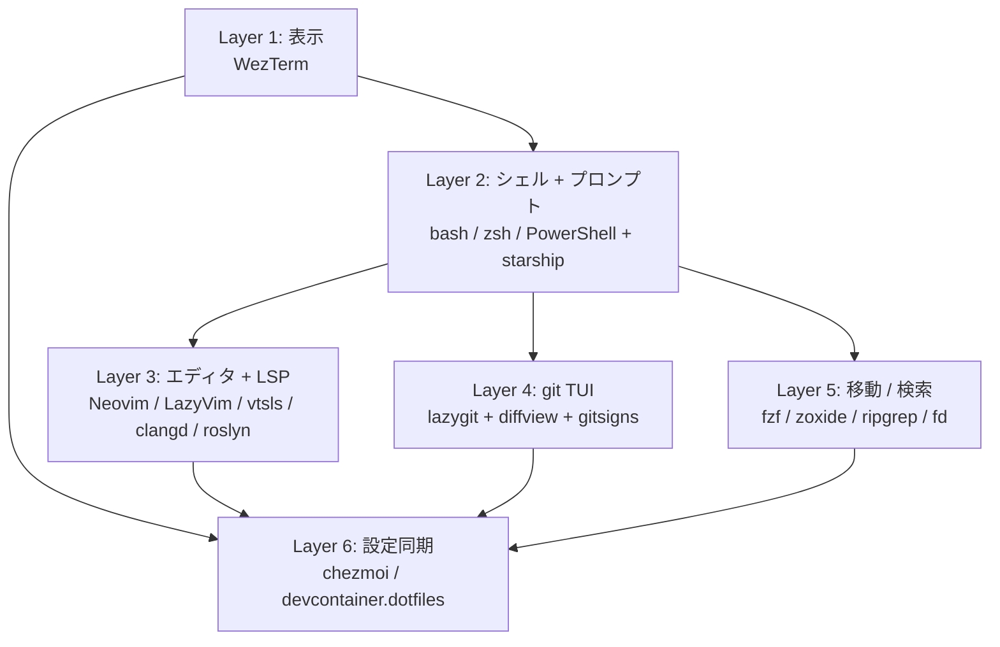
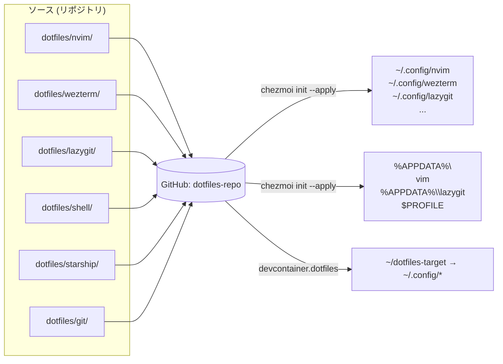
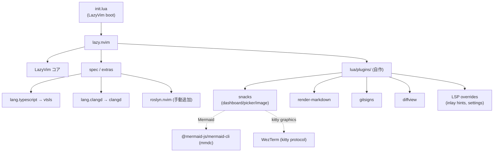
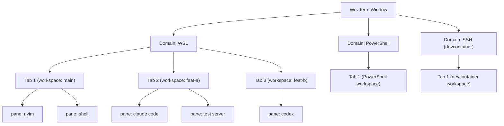
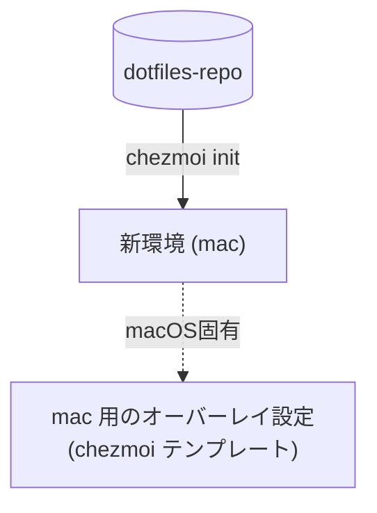

# アーキテクチャ

## 全体像

```mermaid
graph TB
  subgraph Host["Windows Host"]
    WT["WezTerm<br/>(mux + domain + workspace)"]
  end

  WT -->|domain: WSL| WSL["WSL2 Arch"]
  WT -->|domain: PowerShell| PS["PowerShell"]
  WT -->|domain: SSH| DC["devcontainer / remote"]
  WT -->|domain: SSH| RDP["将来: Linux / Mac 直"]

  subgraph WSLEnv["WSL 環境"]
    WSL --> ZSH["zsh / bash<br/>(starship prompt)"]
    ZSH --> NV1["Neovim (LazyVim)"]
    ZSH --> LG1["lazygit"]
    ZSH --> ALI1["eza, bat, fd, ripgrep, fzf, zoxide"]
  end

  subgraph PSEnv["PowerShell 環境"]
    PS --> PSProf["PSReadLine + Starship"]
    PSProf --> NV2["Neovim (LazyVim)"]
    PSProf --> LG2["lazygit"]
    PSProf --> ALI2["eza, bat, fd, ripgrep, fzf, zoxide"]
  end

  subgraph DCEnv["devcontainer"]
    DC --> SH3["bash + starship"]
    SH3 --> NV3["Neovim (LazyVim)"]
    SH3 --> LG3["lazygit"]
    SH3 --> ALI3["同等の CLI ツール"]
  end

  NV1 -. chezmoi .-> DOTS
  NV2 -. chezmoi .-> DOTS
  NV3 -. devcontainer.dotfiles .-> DOTS
  DOTS[("GitHub: dotfiles-repo")]

  LG1 --> WT1[("git worktree")]
  LG2 --> WT1
  LG3 --> WT1

  WT1 --> AG1[Agent 1: Claude Code]
  WT1 --> AG2[Agent 2: Codex]
  WT1 --> YOU[自分の Neovim]

  classDef host fill:#fab387,color:#1e1e2e,stroke:#1e1e2e
  classDef env fill:#a6e3a1,color:#1e1e2e,stroke:#1e1e2e
  classDef dot fill:#89b4fa,color:#1e1e2e,stroke:#1e1e2e
  classDef agent fill:#cba6f7,color:#1e1e2e,stroke:#1e1e2e
  class WT host
  class WSL,PS,DC env
  class DOTS dot
  class AG1,AG2,YOU agent
```

---

## レイヤ別責務



| Layer | 役割 | 該当ツール |
|---|---|---|
| 1. 表示 | ターミナル描画 / ペイン分割 / domain 切替 | WezTerm |
| 2. シェル | コマンド実行環境・プロンプト | bash / zsh / PowerShell + starship |
| 3. エディタ | 編集・LSP・Markdown 描画 | Neovim + LazyVim + snacks / render-markdown / 各 LSP |
| 4. git TUI | worktree 作成・コミット・diff 確認 | lazygit + gitsigns.nvim + diffview.nvim |
| 5. 移動 / 検索 | ファイル移動・全文検索・履歴 | fzf / zoxide / ripgrep / fd / eza / bat |
| 6. 設定同期 | 3 環境で設定を単一リポジトリから配信 | chezmoi / devcontainer.json dotfiles |

---

## dotfiles 配布のデータフロー



---

## Neovim (LazyVim) 内部構成



---

## WezTerm の domain / workspace モデル



- **Domain**: プロセス (WSL, PowerShell, SSH) を識別
- **Workspace**: そのドメイン内の論理グループ (worktree 1:1 が基本)
- **Tab / Pane**: 実際の UI

---

## 拡張ポイント

新環境 (例: 会社の mac) を追加する場合:



- `chezmoi/templates/` 配下に `.tmpl` ファイルで OS 別分岐を書く
- mac 固有 (`iTerm2` から移行するなら AppleScript で WezTerm 起動等) もここに集約
- 新言語 LSP 追加: `init.lua` の `spec.extras.lang` に 1 行追加

---

## 関連

- [setup-guide.md](setup-guide.md) — 構築手順
- [worktree-workflow.md](worktree-workflow.md) — 並行開発
- [../README.md](../README.md) — トップ
- [../design.md](../design.md) — 元となった設計
