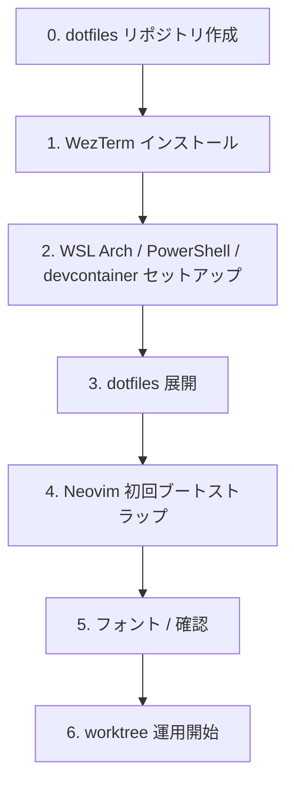
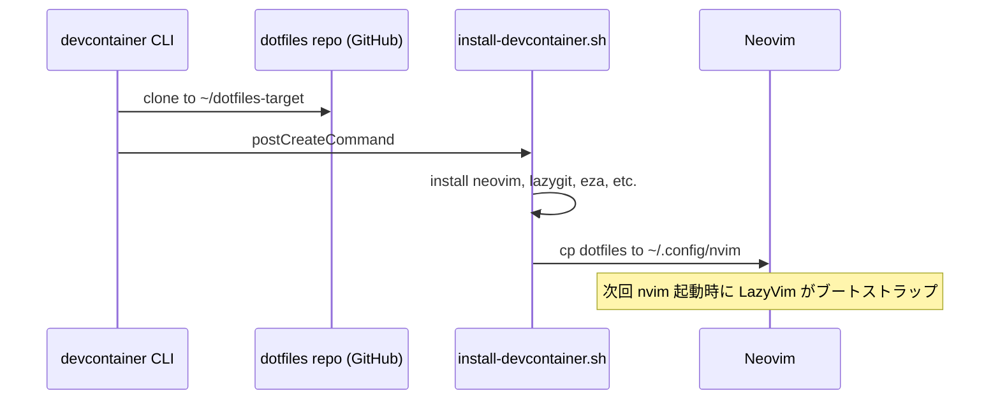
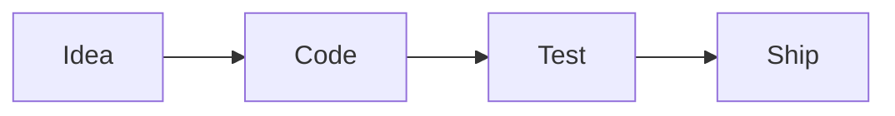

# セットアップガイド

WSL Arch / Windows PowerShell / devcontainer の 3 環境で **同一の見た目・キーバインド** を持つターミナル開発環境を構築する手順書。

> 構築後のイメージ図は [architecture.md](architecture.md) を参照。

## 全体フロー



---

## 0. dotfiles リポジトリの準備

このリポジトリの `dotfiles/` 配下を、自分の dotfiles 用リポジトリに push します。

```bash
mkdir ~/dotfiles-repo
cp -r path/to/terminal_env/dotfiles/. ~/dotfiles-repo/
cd ~/dotfiles-repo
git init && git add -A && git commit -m "Initial commit"
gh repo create dotfiles-repo --private --source=. --remote=origin --push
```

以降のドキュメントでは `https://github.com/your-name/dotfiles-repo.git` の URL を自分のものに置き換えてください。

---

## 1. WezTerm (Windows)

WezTerm はマルチプレクサ内蔵のターミナルエミュレータ。Windows / macOS / Linux すべてで同じキーバインドが使える。

### インストール

```powershell
# winget 経由
winget install wez.wezterm

# Chocolatey / Scoop でも可
scoop install wezterm
```

### フォント

[JetBrainsMono Nerd Font](https://www.nerdfonts.com/font-downloads) をインストールし、WezTerm のフォントに設定。

```powershell
winget install DEVCOM.JetBrainsMonoNerdFont
```

### 設定

`%USERPROFILE%\.config\wezterm\wezterm.lua` に [dotfiles/wezterm/wezterm.lua](../../dotfiles/wezterm/wezterm.lua) を配置。

`$env:WSL_DISTRO_NAME = "Arch"` を PowerShell profile に追加するか、Windows Terminal の `wsl.exe -d Arch` をランチャーに登録。

### 確認

```powershell
wezterm start
# Ctrl+Shift+a → Ctrl+Shift+w でランチャー → "domain: WSL" が表示されれば OK
```

---

## 2-A. WSL Arch (Linux 側)

### 前提

- WSL2 が有効 (`wsl --list --verbose` で確認)
- Arch distro がインストールされている
  - 未インストール: `wsl --install -d Arch`

### シェルに入る

```powershell
# あるいは WezTerm から直接 wsl.exe
wsl -d Arch
```

### パッケージのインストール

```bash
sudo pacman -Syu
# 注: Arch では delta → git-delta, npm は nodejs に同梱されているため個別不要
sudo pacman -S --needed neovim git lazygit starship fzf zoxide eza bat ripgrep fd git-delta \
               nodejs go rust python base-devel clang llvm lldb gdb

# AUR (yay が入っている前提)
yay -S --noconfirm wezterm

# フォント
mkdir -p ~/.local/share/fonts
cd ~/.local/share/fonts
curl -L -o jbm.zip "https://github.com/ryanoasis/nerd-fonts/releases/latest/download/JetBrainsMono.zip"
unzip -qo jbm.zip && rm jbm.zip
fc-cache -fv
```

### chezmoi (dotfiles 管理)

```bash
# Arch
sudo pacman -S chezmoi

# 適用
chezmoi init --apply https://github.com/your-name/dotfiles-repo.git
```

手動で `scripts/install-linux.sh` を実行しても OK。

### 確認

```bash
which nvim lazygit eza bat rg fd starship
echo $EDITOR    # → nvim
nvim --version | head -1
```

---

## 2-B. Windows (PowerShell)

### ツールのインストール

```powershell
winget install `
  wez.wezterm `
  Neovim.Neovim `
  Git.Git `
  jesseduffield.lazygit `
  Starship.Starship `
  junegunn.fzf `
  ajeetdsouza.zoxide `
  eza-community.eza `
  sharkdp.bat `
  BurntSushi.ripgrep.MSVC `
  sharkdp.fd `
  OpenJS.NodeJS.LTS `
  DEVCOM.JetBrainsMonoNerdFont
```

### シェル設定

`$PROFILE` (例: `C:\Users\<user>\Documents\PowerShell\Microsoft.PowerShell_profile.ps1`) に [dotfiles/shell/powershell/Microsoft.PowerShell_profile.ps1](../../dotfiles/shell/powershell/Microsoft.PowerShell_profile.ps1) を配置。

### chezmoi

```powershell
winget install twpayne.chezmoi
# パス反映のため新しい PowerShell を開く
chezmoi init --apply https://github.com/your-name/dotfiles-repo.git
```

---

## 2-C. devcontainer

### 1. devcontainer.json を配置

プロジェクトルート (または `.devcontainer/devcontainer.json`) に [devcontainer/devcontainer.json](../../devcontainer/devcontainer.json) を配置。
`dotfiles.repository` を自分の URL に変更する。

### 2. 起動

```bash
# CLI
devcontainer up --workspace-folder .

# VS Code
# コマンドパレット → "Dev Containers: Reopen in Container"
```

### 3. 自動実行される処理



---

## 3. dotfiles の反映 (chezmoi 経由)

```bash
chezmoi status
chezmoi diff
chezmoi apply --verbose
```

### 変更したら

```bash
# 1. ローカルで編集
nvim ~/.config/nvim/lua/plugins/snacks.lua

# 2. chezmoi ソースに取り込み
chezmoi re-add ~/.config/nvim/lua/plugins/snacks.lua

# 3. コミット & プッシュ
chezmoi cd
git add -A && git commit -m "Update snacks config"
git push

# 4. 別環境
chezmoi update
```

---

## 4. Neovim 初回ブートストラップ

```bash
nvim ~/.config/nvim/init.lua
```

LazyVim が自動的に:

- `lazy.nvim` を `~/.local/share/nvim/lazy/lazyvim/` に clone
- 全プラグインを pull
- Mason が利用可能な場合は自動セットアップ (`:Mason` で確認)

初回は数十秒〜数分かかる。`:Lazy` で進捗確認。

### LSP の動作確認

`init.lua` で指定した各言語のファイルを開いてみる:

- `*.ts` / `*.tsx` → vtsls
- `*.cpp` / `*.h` → clangd
- `*.cs` → roslyn.nvim

`gd` (定義ジャンプ), `gr` (参照一覧), `K` (hover) が動けば LSP が効いている。

### Mermaid の確認

```bash
# Mermaid CLI の確認
mmdc --version

# なければ
# - 通常の npm (root 所有) の場合:
sudo npm install -g @mermaid-js/mermaid-cli
# - Volta / nvm 等のユーザー所有 npm の場合は sudo 不要:
npm install -g @mermaid-js/mermaid-cli
```

WezTerm 内で `nvim sample.md` を開き、```mermaid ブロックがあれば `snacks.image` がレンダリングする。

サンプル:

````markdown

````

---

## 5. 動作確認チェックリスト

| 項目 | 確認コマンド / 操作 |
|---|---|
| WezTerm が起動 | `wezterm start` |
| WSL タブが開く | Ctrl+Shift+w → WSL |
| PowerShell タブが開く | Ctrl+Shift+w → PowerShell |
| Neovim が起動 | `nvim` |
| Markdown がレンダリング | `nvim README.md` → 見出し装飾 |
| Mermaid が表示される | ```mermaid``` ブロックを開く |
| LSP が動く | TS / C++ / C# ファイルで `gd` |
| lazygit が動く | `<Space>gg` または `lazygit` |
| worktree 作成 | `git worktree add ../proj-feat -b feat` |
| starship プロンプト | ターミナル再起動 |
| fzf 検索 | `<Ctrl-T>` (ファイル) / `<Ctrl-R>` (履歴) |
| zoxide 移動 | `z partial/path` |
| chezmoi 状態 | `chezmoi status` |

---

## 6. よくあるハマりどころ

### `kitty graphics protocol` が無効

`wezterm.lua` の `enable_kitty_graphics` が `true` か確認。
Mermaid ブロックがプレーンなテキストのままなら、ここの値を確認する。

### `snacks.image` の `supported` リスト

`dotfiles/nvim/lua/plugins/snacks.lua` の `image.supported` が WezTerm / kitty / Ghostty を含むか確認。ターミナルが未対応のものは `chafa` フォールバックに切替可能。

### `lspconfig` の `package.json` 警告 (JS/TS)

`vtsls` の LSP が `package.json` を見つけられない警告。プロジェクトルートに `package.json` があるか、もしくは `tsconfig.json` があるか確認。

### WSL 側から `git` の `credential.helper` が動かない

`git config --global credential.helper "/mnt/c/Program\ Files/Git/mingw64/libexec/git-core/git-credential-manager.exe"` のような Windows 側マネージャへのパスを設定する。

### PowerShell の `PSReadLine` Vi モードが変

PowerShell 7 以降なら `Set-PSReadLineOption -EditMode Vi` で改善。5.1 では `PSReadLine` のバージョンを `Install-Module PSReadLine -Force` で更新。

---

## 次のステップ

- [worktree-workflow.md](worktree-workflow.md) — Agent × worktree 並行開発
- [architecture.md](architecture.md) — 全体アーキテクチャ
- [../chezmoi/README.md](../chezmoi/README.md) — dotfiles 配布戦略
