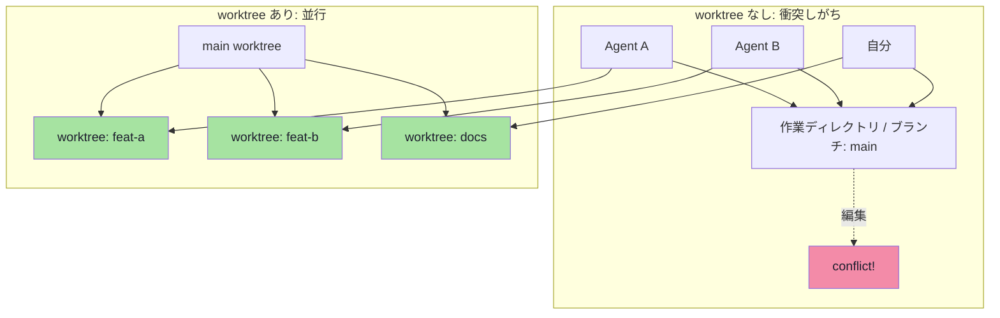
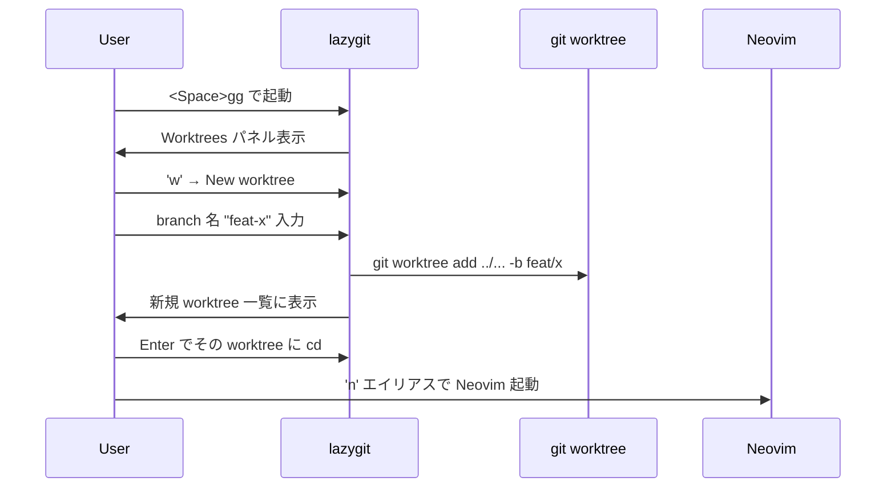
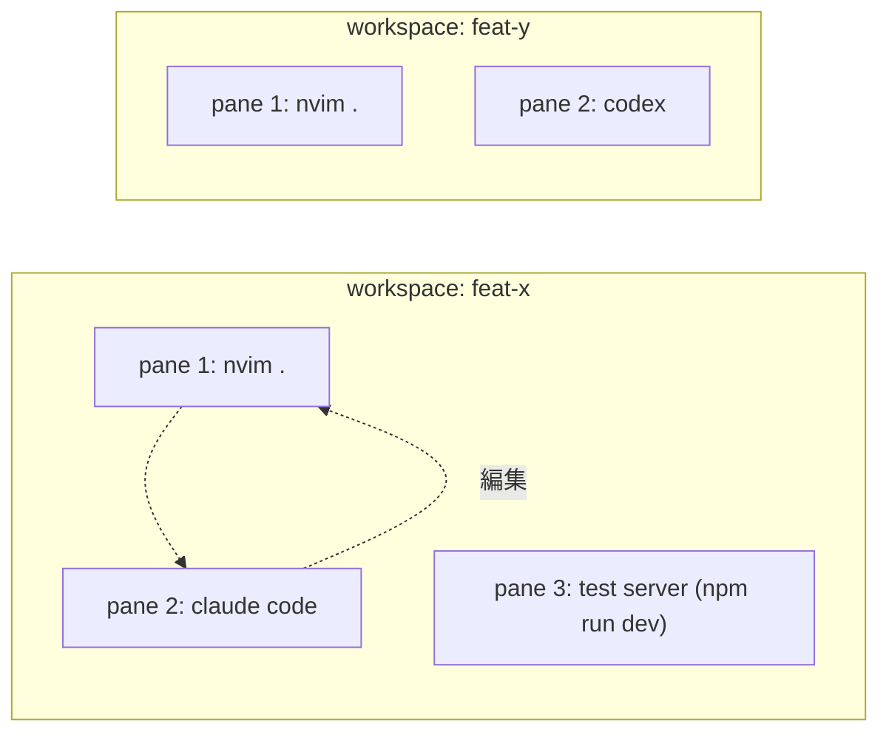
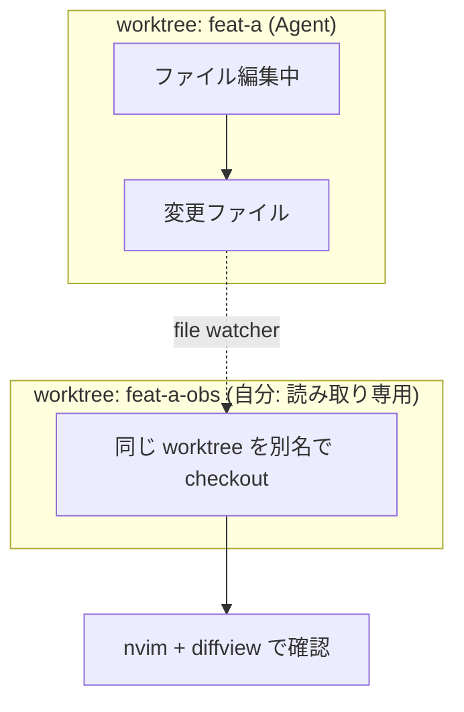

# git worktree × Agent 並行開発ガイド

この環境の中核機能。1 つのリポジトリで複数の worktree を使い、Agent と自分が同じマシンで干渉せず作業する。

## なぜ worktree?



- Agent が作業ディレクトリを触っている間、自分は同じブランチで作業できない
- → **worktree で物理的に分離**すれば、各 Agent / 自分がそれぞれ独立した作業ディレクトリを持つ
- 同じプロジェクトの別ブランチが同時進行できる

---

## 基本コマンド

```bash
# 一覧
git worktree list
# 別名: gwl

# 作成 (新ブランチ + ディレクトリ)
git worktree add ../myproject-feat-x -b feat/x main
# 別名: gwa

# 既存ブランチの worktree を作る
git worktree add ../myproject-bugfix bugfix/header
# 既存ブランチを切替せず、別ディレクトリに展開

# 削除 (マージ済みなら)
git worktree remove ../myproject-feat-x
# 別名: gwr

# 強制削除 (未マージ含む)
git worktree remove --force ../myproject-feat-x
```

エイリアスは [dotfiles/git/.gitconfig](../../dotfiles/git/.gitconfig) と [dotfiles/shell/bash_aliases.sh](../../dotfiles/shell/bash_aliases.sh) に定義済。

---

## lazygit での操作

Lazygit の `Worktrees` パネル (`w` キー) から GUI で操作可能。



---

## WezTerm workspace との統合

各 worktree に対し WezTerm の **workspace** を割り当てると、ランチャーから 1 キーで切替できる。

`dotfiles/wezterm/wezterm.lua` の `keys` セクション:

```lua
{ key = "1", mods = "LEADER", action = act.SwitchToWorkspace { name = "main" } },
{ key = "2", mods = "LEADER", action = act.SwitchToWorkspace { name = "feat-a" } },
{ key = "3", mods = "LEADER", action = act.SwitchToWorkspace { name = "feat-b" } },
```

各 workspace には worktree ディレクトリへの Neovim + Agent ペインが含まれる。
`wezterm start --workspace <name>` で直接起動も可能。

### 自動起動スクリプト例

```bash
# scripts/start-worktree.sh
WORKTREE_DIR="${1:-$PWD}"
WORKSPACE_NAME=$(basename "$WORKTREE_DIR")

cd "$WORKTREE_DIR"

# WezTerm の multiplexer 上で workspace を切替 / 起動
wezterm start --workspace "$WORKSPACE_NAME" -- nvim .
```

これを `gwup` (`git worktree up`) のようなエイリアスにしておくと、新規 worktree 作成から Neovim 起動まで一発。

---

## Agent 起動パターン

### パターン A: worktree 内に直接

```bash
# worktree 作成
gwa ../proj-feat-x -b feat/x

# Agent を起動 (worktree 内で)
cd ../proj-feat-x
claude code          # または codex / copilot-cli
```

### パターン B: WezTerm の domain / workspace で環境を分けて起動

```lua
-- dotfiles/wezterm/wezterm.lua に追加する例
-- leader は Ctrl+a
{
  key = "a", mods = "LEADER",
  action = act.SpawnTab "CurrentPaneDomain",
  args = { "claude", "code" },
}
```



### パターン C: Claude Code 自身の worktree 分離機能

Claude Code は `--worktree` のようなフラグ / 内部機能を持っている。worktree を意識せずに自動で分離させる運用も可能。

```bash
# (将来 / 現在) Claude Code の worktree フラグ
claude code --worktree feat-x
```

実装は公式ドキュメントの最新版を参照。

---

## レビュー / テストのワークフロー

### Agent 出力の取り込み

```bash
# worktree を main にマージ (自分の中だけで完結)
cd ../proj-main
git merge --no-ff feat/x

# diffview でレビュー
nvim ../proj-main
<Space>gd   # diffview 開く
```

### Agent の作業を横から観察



実装イメージ:

```bash
# 観測用 worktree を作る
git worktree add ../proj-feat-a-obs --detach feat/a
# → 自分の Neovim からは ../proj-feat-a-obs を開く
# → Agent が変更した結果が反映される
```

### worktree 間で差分確認

```vim
" 自分の Neovim で worktree 間の diff を開く
:DiffviewOpen HEAD..feat/x
" 設定済: <leader>gw で main/master との diff
```

---

## クリーンアップ

```bash
# 古い worktree 一覧
git worktree list
gwl

# 削除
gwr ../proj-feat-a
git worktree prune    # メタデータの掃除
```

### 共通ディレクトリ (.env, node_modules 等) の共有

各 worktree で `node_modules` を再生成するのは時間がかかる。`/tmp` 配下に共通化するか、シンボリックリンクを活用:

```bash
# 例: メイン worktree の node_modules を共有
ln -s ../../proj-main/node_modules ../proj-feat-a/node_modules
```

---

## まとめ: 運用上のベストプラクティス

| 観点 | 推奨 |
|---|---|
| 1 task = 1 worktree | Agent 起動前に `gwa ../<repo>-<branch> -b <branch>` |
| 命名規則 | `../<repo>-<short-desc>` (例: `../proj-fix-header`) |
| マージ | 自分の中だけで main にマージして動作確認 → リモートに push |
| 掃除 | 週次で `git worktree list` を見、終わったら `gwr` |
| Agent の状態確認 | worktree-obs パターン (別 worktree から読み取り専用観測) |
| LSP 起動 | 各 worktree ごとに Neovim を起動すれば OK (LSP は worktree ごとに閉じる) |

---

## 関連

- [setup-guide.md](setup-guide.md) — 環境構築
- [architecture.md](architecture.md) — 全体像
- [../README.md](../README.md) — トップ
